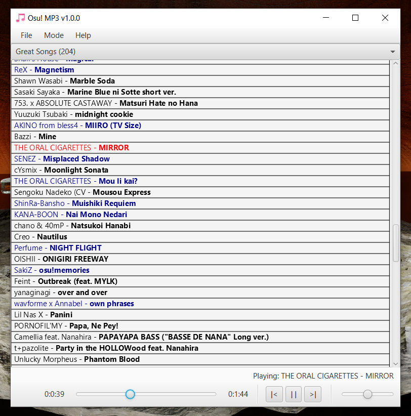

# Osu!-MP3

**Music player that enables playback from your Osu! directory!**
 
 
**Supports: Osu! Lazer and Osu! Stable.**
 
**Requires: Java 17+**
 
**Tested: Windows 10**

## How to use:
1. Open Osu!
2. Add Osu! beatmaps to a collection to be used as a playlist. (Osu! Stable: Close Osu! to apply collection changes).
3. Place Osu!-MP3 jar file in a folder, as the program will create items within the same directory.
4. Start Osu!-MP3.
5. For Osu! Stable: Go to (File > Set Osu! Stable Folder) and set this to the Osu! Stable installation directory.
Osu! Stable Mode will initialize and begin building a cache of songs (This may take a few minutes to process).
6. For Osu! Lazer: Go to (File > Set Osu! Lazer Folder) and set this to the Osu! Lazer "data directory" (Not installation directory).
7. Click a song name to begin playing a shuffled playlist of the selected collection.
8. You can switch between collections using the combo-box near the top of the window.
9. You can switch between Osu! Lazer and Osu! Stable modes using the Mode Menu.

## Controls:
* Up and down arrow keys for volume.
* Space key to play/pause.
* Keyboard and headphone media keys for audio playback (Play/Pause, SkipNext/SkipPrev) (Even while program is minimized).
* Click and drag or use mouse-wheel to scroll song panel.

## Notes:
* For headphones with a single media button, the media controls are usually: double-click = next song, triple-click = prev song, single-click = play/pause

## Libraries Used:
* https://github.com/tulskiy/jkeymaster for media button keystrokes.
* https://github.com/hendriks73/ffsampledsp and https://github.com/hendriks73/audioplayer4j for .OGG and .MP3 audio playback.
* https://github.com/mpatric/mp3agic for obtaining MP3 audio length.
* https://github.com/controlsfx/controlsfx for Searchable ComboBox
* https://github.com/openjdk/jfx for GUI components.
* https://github.com/realm/realm-kotlin for reading Osu! Lazer database.

## Preview:

