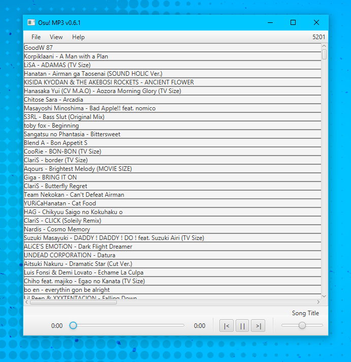

# Osu-MP3
Play Songs From Your Osu! Directory!

 
**Requires: Java 8**
 
**Tested on Windows 10.**

**How to use:**
1. Place jar file in folder, as the program will create two files within same directory.
2. Add Osu! beatmaps to a collection to be used as a playlist. Close Osu! to apply collection changes.
3. Within OsuMP3 go to (File > Get Osu! Folder) and select your Osu! folder (not songs folder).
4. Click a song name to begin playing a shuffled playlist of the selected collection (column).

**Controls:**
* Up and down arrow keys for volume.
* Space key to play/pause.
* Keyboard and headphone media keys for audio playback (Play/Pause, SkipNext/SkipPrev).
* Click and drag mouse to move song panel around.

**Notes:**
* You can now use keyboard and headphone media keys to control the program (even while minimized)
* For headphones with one media button the controls are usually: double-click = next song, tripple-click = prev song, single-click = play/pause
* Only capable of playing songs added to Osu! collections at this time.
* Osu! saves to its "Collections" file when you close the game.

Uses library: https://github.com/tulskiy/jkeymaster for media keystrokes

